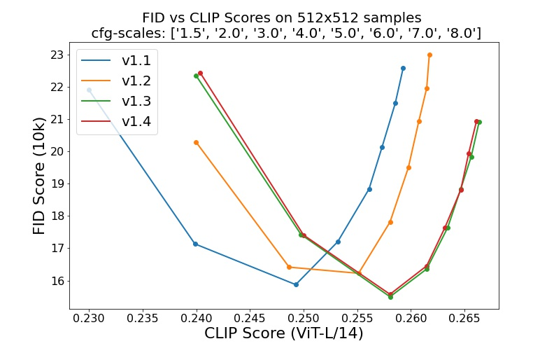

# nchu-cse 111-1 IOT 期末專案
```
楊承峻 7111056421
陳芝云 7111056187
范姜沂妘 7111056248
```
------
# Stable Diffusion
## 新增OptimizedSD及Line Bot，成功連接後將專案利用docker打包成imgae供別人使用。
1. OptimizedSD為Stable Diffusion repo 的修改版本，經過優化以透過犧牲推理速度使用比原始版本更少的 VRAM。原本的Stable Diffusion模型分為四個部分
，將過程變更為僅在需要時才發送給 GPU。計算完成後，再將它們移回 CPU，藉此減少 VRAM 的使用。

2. Line Bot透過ngrok接收訊息後，呼叫模型進行運算，運算後的結果透過imgurl讓圖片有專屬的網址，再藉由line_bot_api的ImageSendMessage將圖片回傳給使用者。

3. 透過docker 將專案(Stable Diffusion + Line Bot)打包成Image


我們使用到以下兩種功能：
------

### Text-to-Image with Stable Diffusion


Stable Diffusion是一種潛在擴散模型，它根據CLIP ViT-L/14 文字編碼(non-pooled)的文本遷入進行調整，
默認情況下，guidance scale 會是  `--scale 7.5` ，[Katherine Crowson's implementation](https://github.com/CompVis/latent-diffusion/pull/51)的[PLMS](https://arxiv.org/abs/2202.09778)的sampler，以及在50 steps中呈現 512x512的圖像，下方列出了所有支援的參數

(type `python scripts/txt2img.py --help`)

```commandline
usage: txt2img.py [-h] [--prompt [PROMPT]] [--outdir [OUTDIR]] [--skip_grid] [--skip_save] [--ddim_steps DDIM_STEPS] [--plms] [--laion400m] [--fixed_code] [--ddim_eta DDIM_ETA]
                  [--n_iter N_ITER] [--H H] [--W W] [--C C] [--f F] [--n_samples N_SAMPLES] [--n_rows N_ROWS] [--scale SCALE] [--from-file FROM_FILE] [--config CONFIG] [--ckpt CKPT]
                  [--seed SEED] [--precision {full,autocast}]

optional arguments:
  -h, --help            show this help message and exit
  --prompt [PROMPT]     the prompt to render
  --outdir [OUTDIR]     dir to write results to
  --skip_grid           do not save a grid, only individual samples. Helpful when evaluating lots of samples
  --skip_save           do not save individual samples. For speed measurements.
  --ddim_steps DDIM_STEPS
                        number of ddim sampling steps
  --plms                use plms sampling
  --laion400m           uses the LAION400M model
  --fixed_code          if enabled, uses the same starting code across samples
  --ddim_eta DDIM_ETA   ddim eta (eta=0.0 corresponds to deterministic sampling
  --n_iter N_ITER       sample this often
  --H H                 image height, in pixel space
  --W W                 image width, in pixel space
  --C C                 latent channels
  --f F                 downsampling factor
  --n_samples N_SAMPLES
                        how many samples to produce for each given prompt. A.k.a. batch size
  --n_rows N_ROWS       rows in the grid (default: n_samples)
  --scale SCALE         unconditional guidance scale: eps = eps(x, empty) + scale * (eps(x, cond) - eps(x, empty))
  --from-file FROM_FILE
                        if specified, load prompts from this file
  --config CONFIG       path to config which constructs model
  --ckpt CKPT           path to checkpoint of model
  --seed SEED           the seed (for reproducible sampling)
  --precision {full,autocast}
                        evaluate at this precision
```

------

### Image Modification with Stable Diffusion

通過使用 [SDEdit](https://arxiv.org/abs/2108.01073) 首次提出的擴散去噪機制，該模型可用於不同的任務，例如text-guided image-to-image translation and upscaling，類似txt2img的採樣腳本，作者提供了一個腳本來對Stable Diffusion進行圖像修改

以下是在[Pinta](https://www.pinta-project.com/)中製作的草稿轉為藝術品的範例

```
python scripts/img2img.py --prompt "A fantasy landscape, trending on artstation" --init-img <path-to-img.jpg> --strength 0.8
```
此範例中，strength是一個介於0.0到1.0之間的值，它控制將雜訊增加到輸入圖片的數量。

接近1.0的值允許很大的變化，但也會產生和輸入語意不一致的圖片。可以參考下方的範例


**Input**


**Outputs**


此過程也可以用於放大基礎模型的樣本

## Stable Diffusion v1

Stable Diffusion v1 refers to a specific configuration of the model
architecture that uses a downsampling-factor 8 autoencoder with an 860M UNet
and CLIP ViT-L/14 text encoder for the diffusion model. The model was pretrained on 256x256 images and 
then finetuned on 512x512 images.

*Note: Stable Diffusion v1 is a general text-to-image diffusion model and therefore mirrors biases and (mis-)conceptions that are present
in its training data. 
Details on the training procedure and data, as well as the intended use of the model can be found in the corresponding [model card](Stable_Diffusion_v1_Model_Card.md).*

The weights are available via [the CompVis organization at Hugging Face](https://huggingface.co/CompVis) under [a license which contains specific use-based restrictions to prevent misuse and harm as informed by the model card, but otherwise remains permissive](LICENSE). While commercial use is permitted under the terms of the license, **we do not recommend using the provided weights for services or products without additional safety mechanisms and considerations**, since there are [known limitations and biases](Stable_Diffusion_v1_Model_Card.md#limitations-and-bias) of the weights, and research on safe and ethical deployment of general text-to-image models is an ongoing effort. **The weights are research artifacts and should be treated as such.**

[The CreativeML OpenRAIL M license](LICENSE) is an [Open RAIL M license](https://www.licenses.ai/blog/2022/8/18/naming-convention-of-responsible-ai-licenses), adapted from the work that [BigScience](https://bigscience.huggingface.co/) and [the RAIL Initiative](https://www.licenses.ai/) are jointly carrying in the area of responsible AI licensing. See also [the article about the BLOOM Open RAIL license](https://bigscience.huggingface.co/blog/the-bigscience-rail-license) on which our license is based.

### Weights

We currently provide the following checkpoints:

- `sd-v1-1.ckpt`: 237k steps at resolution `256x256` on [laion2B-en](https://huggingface.co/datasets/laion/laion2B-en).
  194k steps at resolution `512x512` on [laion-high-resolution](https://huggingface.co/datasets/laion/laion-high-resolution) (170M examples from LAION-5B with resolution `>= 1024x1024`).
- `sd-v1-2.ckpt`: Resumed from `sd-v1-1.ckpt`.
  515k steps at resolution `512x512` on [laion-aesthetics v2 5+](https://laion.ai/blog/laion-aesthetics/) (a subset of laion2B-en with estimated aesthetics score `> 5.0`, and additionally
filtered to images with an original size `>= 512x512`, and an estimated watermark probability `< 0.5`. The watermark estimate is from the [LAION-5B](https://laion.ai/blog/laion-5b/) metadata, the aesthetics score is estimated using the [LAION-Aesthetics Predictor V2](https://github.com/christophschuhmann/improved-aesthetic-predictor)).
- `sd-v1-3.ckpt`: Resumed from `sd-v1-2.ckpt`. 195k steps at resolution `512x512` on "laion-aesthetics v2 5+" and 10\% dropping of the text-conditioning to improve [classifier-free guidance sampling](https://arxiv.org/abs/2207.12598).
- `sd-v1-4.ckpt`: Resumed from `sd-v1-2.ckpt`. 225k steps at resolution `512x512` on "laion-aesthetics v2 5+" and 10\% dropping of the text-conditioning to improve [classifier-free guidance sampling](https://arxiv.org/abs/2207.12598).

Evaluations with different classifier-free guidance scales (1.5, 2.0, 3.0, 4.0,
5.0, 6.0, 7.0, 8.0) and 50 PLMS sampling
steps show the relative improvements of the checkpoints:



## Comments 

- Our codebase for the diffusion models builds heavily on [OpenAI's ADM codebase](https://github.com/openai/guided-diffusion)
and [https://github.com/lucidrains/denoising-diffusion-pytorch](https://github.com/lucidrains/denoising-diffusion-pytorch). 
Thanks for open-sourcing!

- The implementation of the transformer encoder is from [x-transformers](https://github.com/lucidrains/x-transformers) by [lucidrains](https://github.com/lucidrains?tab=repositories). 


## BibTeX

```
@misc{rombach2021highresolution,
      title={High-Resolution Image Synthesis with Latent Diffusion Models}, 
      author={Robin Rombach and Andreas Blattmann and Dominik Lorenz and Patrick Esser and Björn Ommer},
      year={2021},
      eprint={2112.10752},
      archivePrefix={arXiv},
      primaryClass={cs.CV}
}
```


